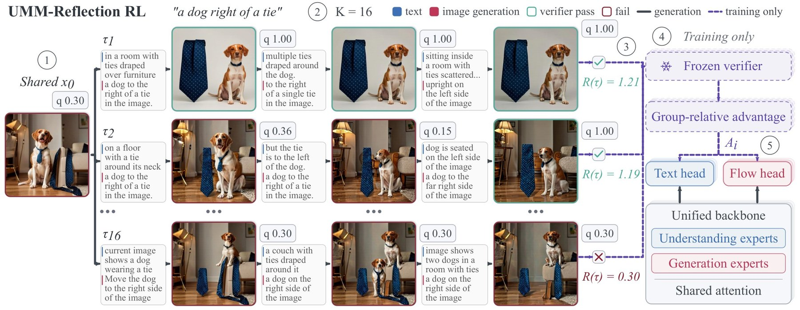
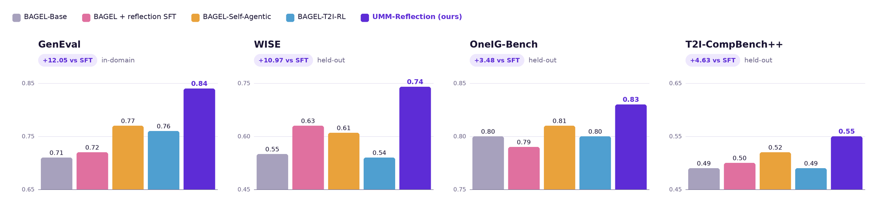
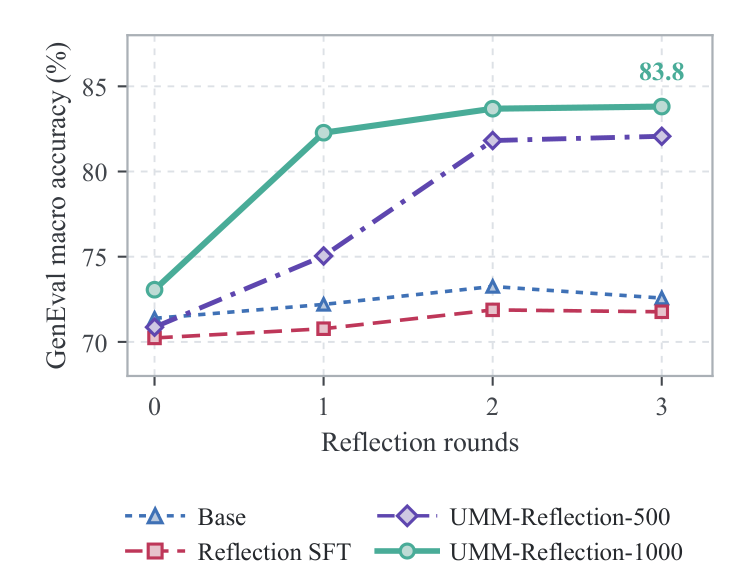
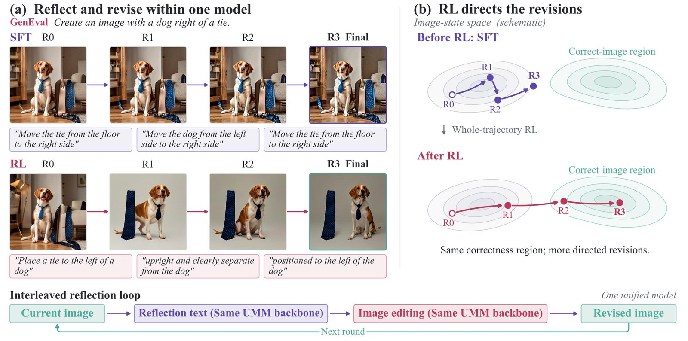
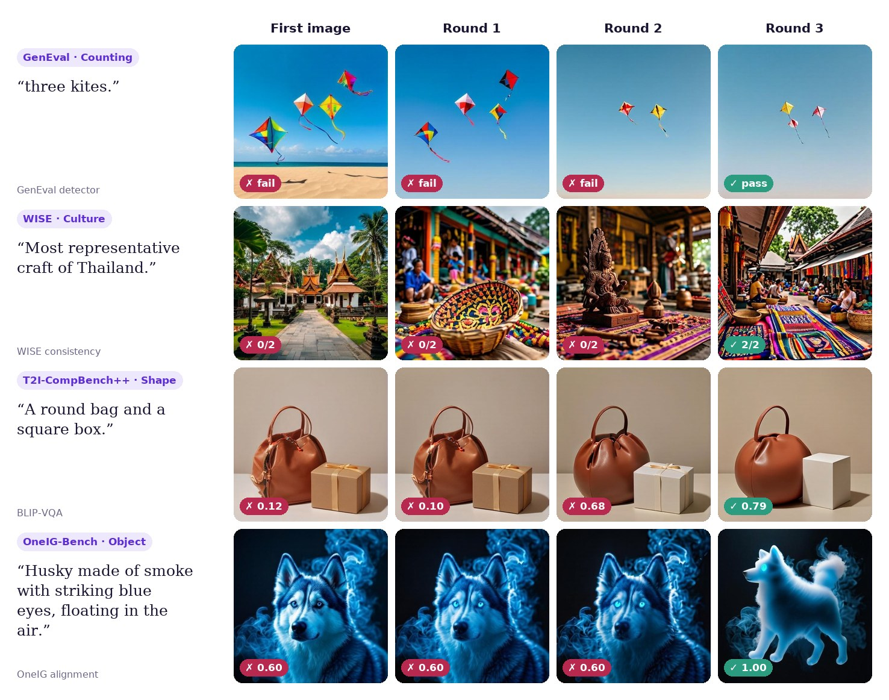
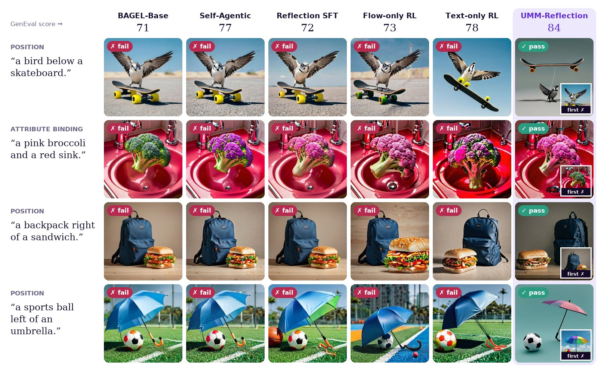

<div align="center">

# UMM-Reflection

### Learning Native Reflection in Unified Models with Interleaved Reinforcement Learning

[](https://waltstephen.github.io/UMM-Reflection/)
[](paper/UMM-Reflection.pdf)
[](#citation)
[](https://huggingface.co/YijiaFan/UMM-Reflection-BAGEL-RL)
[](https://huggingface.co/YijiaFan/UMM-Reflection-BAGEL-SFT)
[](https://huggingface.co/datasets/YijiaFan/UMM-Reflection-SFT-Data)
[](LICENSE)

</div>

<p align="center"></p>

UMM-Reflection teaches a unified understanding-and-generation model
([BAGEL-7B-MoT](https://huggingface.co/ByteDance-Seed/BAGEL-7B-MoT)) to look at
its own image, decide whether it is done, and, if not, write an edit and render
a corrected image, all inside one model and one context. Reinforcement learning
runs on complete reflection trajectories: sibling trajectories share one first
image, so the group-relative advantage compares reflection strategies, and one
trajectory-level advantage updates both the reflection tokens and the
flow-based revisions. No critic or verifier is used at inference.

## News

- **2026-09-28** Training and evaluation code, the RL and SFT models, and the
  SFT data are released, together with the
  [project page](https://waltstephen.github.io/UMM-Reflection/) and a
  3-minute video.

## Contents

- [Results](#results)
- [Qualitative examples](#qualitative-examples)
- [Quick start](#quick-start)
- [Released weights and data](#released-weights-and-data)
- [Training pipeline](#training-pipeline)
- [Requirements](#requirements) · [Assets](#model-and-verifier-assets)
- [Stage 1: reflection SFT](#stage-1-reflection-sft) · [Stage 2: RL](#stage-2-multi-round-flow-grpo-rl) · [Stage 3: evaluation](#stage-3-geneval-553-evaluation)
- [Citation](#citation)

## Results

RL trains only on GenEval-style prompts. WISE, OneIG-Bench and
T2I-CompBench++ are never seen in training.

<p align="center"></p>
<p align="center"><sub>Each panel has its own y-axis range.</sub></p>

| Model | GenEval | WISE | OneIG-Bench | T2I-CompBench++ |
|---|:---:|:---:|:---:|:---:|
| BAGEL-Base | 0.71 | 0.55 | 0.80 | 0.49 |
| BAGEL + reflection SFT | 0.72 | 0.63 | 0.79 | 0.50 |
| BAGEL-Self-Agentic (3 rounds, no tuning) | 0.77 | 0.61 | 0.81 | 0.52 |
| BAGEL-T2I-RL (1k updates, single shot) | 0.76 | 0.54 | 0.80 | 0.49 |
| **UMM-Reflection** | **0.84** | **0.74** | **0.83** | **0.55** |
| *Gain over reflection SFT (points)* | *+12.05* | *+10.97* | *+3.48* | *+4.63* |

- **The gain is in the repair.** The first image is essentially unchanged; RL
  raises the share of wrong first images that are repaired from 20.6% (SFT)
  to 64.9% on GenEval.
- **Both heads must be trained.** Training only the flow head gives 73 (repair
  22.8%), only the text head 78 (49.4%), both heads 84 (64.9%).
- **Reflection beats re-sampling.** At the same four-image budget, reflection
  scores 84 against 80 for best-of-4 sampling from the stronger T2I-RL
  renderer.

<p align="center"></p>
<p align="center"><sub><b>GenEval accuracy across reflection rounds.</b> The first image (round 0) is comparable across models. SFT gains about 2 points and flattens after round 1. After RL, round 1 alone adds 9 points and the score keeps rising through round 3. The suffixes -500 and -1000 give the number of RL updates.</sub></p>

Per-category scores for every benchmark are on the
[project page](https://waltstephen.github.io/UMM-Reflection/#analysis).

<p align="center"></p>
<p align="center"><sub><b>Same prompt, same first-round quality, different revisions.</b> SFT re-rolls the same mistake across rounds. After RL each edit builds on the previous one. The state-space panel is schematic.</sub></p>

## Qualitative examples

Round-by-round repairs on all four benchmarks. The badge on each image is that
benchmark's own verdict. More examples, with the model's reflections verbatim,
are on the [project page](https://waltstephen.github.io/UMM-Reflection/#examples).

<p align="center"></p>

The same GenEval prompts under every variant. Each column is that model's final
image (BAGEL-Base generates a single image); the inset in the last column is
UMM-Reflection's own first image. These prompts were selected as cases where
only UMM-Reflection's final image passes.

<p align="center"></p>

## Quick start

Download the released RL model and evaluate it on GenEval-553 (one 8-GPU node;
see [Requirements](#requirements) and [GenEval assets](#geneval-assets) for the
two Python environments and the verifier weights):

```bash
huggingface-cli download YijiaFan/UMM-Reflection-BAGEL-RL \
    --local-dir pretrained/UMM-Reflection-BAGEL-RL
ARM=rl MODEL_DIR=pretrained/UMM-Reflection-BAGEL-RL bash scripts/eval/geneval553.sh
```

## Released weights and data

All three are in the Hugging Face collection
[UMM-Reflection](https://huggingface.co/collections/YijiaFan/umm-reflection-6ab95afe909092518d70a158).

| Hugging Face repo | Content |
|---|---|
| [YijiaFan/UMM-Reflection-BAGEL-RL](https://huggingface.co/YijiaFan/UMM-Reflection-BAGEL-RL) | final model: RL checkpoint-1000 merged into full BAGEL weights |
| [YijiaFan/UMM-Reflection-BAGEL-SFT](https://huggingface.co/YijiaFan/UMM-Reflection-BAGEL-SFT) | reflection-SFT model, the RL initialization |
| [YijiaFan/UMM-Reflection-SFT-Data](https://huggingface.co/datasets/YijiaFan/UMM-Reflection-SFT-Data) | 29,529 reflection trajectories and 1,265 anchor rows (research use only) |

Both models have the base BAGEL-7B-MoT layout, so each downloaded directory
can be passed directly as `MODEL_DIR` or `RL_INIT_DIR`.

## Training pipeline

The pipeline has three stages:

1. **Reflection SFT.** Fine-tune base BAGEL on multi-round reflection
   trajectories: controller turns (`<think>`, SCORE, ACTION `EDIT`/`DONE`, edit
   payload), image transitions conditioned on the previous image, verifier
   turns, and a prompt-only anchor that preserves single-shot generation.
2. **Multi-round Flow-GRPO RL.** From the SFT checkpoint, sample 16 complete
   reflection trajectories per prompt from the same first image and optimize
   the text (controller) and flow (image) heads jointly against a graded
   six-family GenEval reward served by an offline detector service.
3. **GenEval-553 evaluation.** Generate with up to three repair rounds and
   report accuracy at every edit budget (the test-time-scaling curve), plus
   repair and damage rates.

## Repository layout

```
assets/        RL prompt pool, GenEval-553 manifest, controller system prompt
configs/sft/   SFT dataset mixture
paper/         paper PDF
scripts/data/  SFT data preparation (pixel caches, row expansion)
scripts/sft/   SFT stage 1 / stage 2 launchers and stage-2 seed derivation
scripts/rl/    RL init directory, reward service, trainer launcher
scripts/eval/  GenEval-553 generation and scoring
src/unify_rl/  multi-round rollout, reward, and training-contract code
third_party/Bagel/      BAGEL model, SFT trainer, and data readers (modified)
third_party/flow_grpo/  Flow-GRPO trainer with the multi-round extension (modified)
```

## Requirements

- **GPUs.** Two nodes of 8 x 80 GB GPUs for SFT and RL. Evaluation runs on one
  8-GPU node.
- **Host memory for RL.** Optimizer state is offloaded to CPU. Plan on about
  1 TB of RAM per node; 512 GB nodes were OOM-killed while restoring a
  checkpoint.
- **Two Python environments.** The GenEval verifiers need `mmcv-full` 1.x,
  which does not build against the trainer's torch, so they run in a separate
  environment and talk to the trainer only over HTTP (reward) or through saved
  images (evaluation).

```bash
# Trainer environment (SFT, RL, generation), Python 3.10, CUDA 12
pip install torch==2.5.1 torchvision==0.20.1 --index-url https://download.pytorch.org/whl/cu124
pip install flash_attn==2.7.4.post1 --no-build-isolation
pip install -r requirements.txt

# GenEval environment (reward service, scoring), Python 3.10, CUDA 11.8
pip install torch==2.0.1 torchvision==0.15.2 --index-url https://download.pytorch.org/whl/cu118
pip install openmim && mim install mmcv-full==1.7.2
pip install -r requirements-geneval.txt
```

Scripts take `PYTHON_BIN` (trainer environment) and, where both are needed,
`GENEVAL_PYTHON_BIN`. Both default to `python`.

## Model and verifier assets

Weights and data are not part of this repository; they are on Hugging Face
(see [Released weights and data](#released-weights-and-data)). By default everything is
looked up under `pretrained/`, `data/` and `outputs/` in the repository root;
each location can be overridden with an environment variable (see the table
below).

**Base model** (the exact revision used for all results):

```bash
huggingface-cli download ByteDance-Seed/BAGEL-7B-MoT \
    --revision 265d1d48ec8e850a29d3a1f208c2a2ec3cd7577b \
    --local-dir pretrained/BAGEL-7B-MoT
```

SFT stage 1 checks that `ema.safetensors` has sha256
`0b41c43835fd737b8c948e604870da522c091dcf151f3e8d55f84781765ee1a3`; set
`VERIFY_BASE_SHA256=0` to skip the check.

### GenEval assets

The reward service and the scorer load the official GenEval verifiers from
`$GENEVAL_ASSETS_DIR` (default `pretrained/geneval`). Every file is pinned by
sha256 in `src/unify_rl/reward_models/geneval_family_registry_v1.py` and is
checked at load time.

```
pretrained/geneval/
  mmdetection/                         mmdetection 2.x checkout (configs only)
  mask2former/
    mask2former_swin-s-p4-w7-224_lsj_8x2_50e_coco.pth
  openclip_hub/
    models--timm--vit_large_patch14_clip_224.openai/snapshots/
      18d0535469bb561bf468d76c1d73aa35156c922b/open_clip_model.safetensors
  T2I-CompBench/BLIPvqa_eval/          BLIP-VQA evaluation code
  blip/
    model_base_vqa_capfilt_large.pth
```

```bash
A=pretrained/geneval
git clone -b v2.28.2 https://github.com/open-mmlab/mmdetection.git $A/mmdetection
mkdir -p $A/mask2former $A/blip
wget -O $A/mask2former/mask2former_swin-s-p4-w7-224_lsj_8x2_50e_coco.pth \
  https://download.openmmlab.com/mmdetection/v2.0/mask2former/mask2former_swin-s-p4-w7-224_lsj_8x2_50e_coco/mask2former_swin-s-p4-w7-224_lsj_8x2_50e_coco_20220504_001756-743b7d99.pth
huggingface-cli download timm/vit_large_patch14_clip_224.openai open_clip_model.safetensors \
  --revision 18d0535469bb561bf468d76c1d73aa35156c922b --cache-dir $A/openclip_hub
git clone https://github.com/Karine-Huang/T2I-CompBench.git $A/T2I-CompBench
wget -O $A/blip/model_base_vqa_capfilt_large.pth \
  https://storage.googleapis.com/sfr-vision-language-research/BLIP/models/model_base_vqa_capfilt_large.pth
```

The detector config is
`mmdetection/configs/mask2former/mask2former_swin-s-p4-w7-224_lsj_8x2_50e_coco.py`;
the GenEval class list ships in
`third_party/Bagel/eval/gen/geneval/evaluation/object_names.txt`.

BLIP-VQA also needs the `bert-base-uncased` tokenizer in the Hugging Face
cache. Services run with `HF_HUB_OFFLINE=1`, so download it once into the
`HF_HOME` you will use:

```bash
HF_HOME=pretrained/hf_home huggingface-cli download bert-base-uncased
```

## Stage 1: reflection SFT

### Data

The SFT data is expected under `$UNIFY_RL_DATA_ROOT/sft` (default `data/sft`).
Download it from Hugging Face (about 100 GB):

```bash
huggingface-cli download --repo-type dataset YijiaFan/UMM-Reflection-SFT-Data \
    --local-dir data/sft
```

```
data/sft/
  trajectory_parquet/                reflection trajectories (29,529 rows)
  anchor/parquet/                    base-BAGEL prompt-only anchor trajectories
  anchor/base_anchor_allowlist.json  the 1,265 anchor rows used by SFT
```

The data is for non-commercial research use; each row follows the license of
its source dataset (see the dataset card).

Build the pixel caches, then expand trajectories into the three row sets the
SFT readers consume:

```bash
bash scripts/data/build_pixel_cache.sh   # -> pixel_cache/, anchor/pixel_cache/
bash scripts/data/prepare_sft_data.sh    # -> rows/{controller_rows_100,
                                         #    transition_rows_96,verifier_rows_96},
                                         #    rows/base_anchor_allowlist.json
```

`prepare_sft_data.sh` refuses to write into an existing `rows/` directory.
BAGEL keys `parquet_info.json` by absolute shard path, so if you move the data
directory, regenerate it with `scripts/data/write_parquet_info.py`
(`build_pixel_cache.sh` does this for the input parquets).

The mixture is defined in `configs/sft/clean29529_multiround_transition_16gpu.yaml`:

| Dataset | Content | Weight |
|---|---|---|
| `clean29529_multiround_controller` | controller turns of whole trajectories | 4 |
| `clean29529_transition_mse` | image transitions (flow-matching loss) | 4 |
| `clean29529_verifier_state` | verifier turns | 4 |
| `clean29529_penultimate_verifier_state` | verifier turn before the final DONE | 1 |
| `base_prompt_only_anchor_mse` | prompt-only anchor images | 1 |

### Training

Both stages run on 2 nodes x 8 GPUs (FSDP `HYBRID_SHARD`); launch the same
command on each node with its `NODE_RANK`.

```bash
# Stage 1: 1,410 steps, cosine LR 2e-6 -> 2e-7, 50 warmup, checkpoint every 350
NODE_RANK=0 MASTER_ADDR=<node0> MASTER_PORT=29500 RUN_DIR=outputs/sft_stage1 \
    bash scripts/sft/train_sft_stage1.sh

# Stage-2 seed: resume the full stage-1 state with a constant-LR schedule and
# a one-epoch sample target (167,363 rows). Large files are symlinked.
python scripts/sft/derive_stage2_seed.py \
    --source outputs/sft_stage1 --output-root outputs/sft_stage2_seed

# Stage 2: constant LR 2e-7 until the epoch is consumed (step 2969)
NODE_RANK=0 MASTER_ADDR=<node0> MASTER_PORT=29500 RUN_DIR=outputs/sft_stage2 \
    RESUME_FROM=outputs/sft_stage2_seed/one_epoch_seed/0001409 \
    bash scripts/sft/train_sft_stage2.sh
```

`RUN_MODE=smoke` runs a few steps without saving (use the `smoke_seed` for
stage 2). W&B logging is online only when `WANDB_API_KEY` is set; otherwise it
is offline.

The RL initialization is `outputs/sft_stage2/ckpts/0002969/model.safetensors`.
The released SFT model is the same checkpoint in BAGEL layout.

## Stage 2: multi-round Flow-GRPO RL

```bash
# 1. RL init directory: base assets symlinked, ema.safetensors -> SFT weights
SFT_CHECKPOINT=outputs/sft_stage2/ckpts/0002969 bash scripts/rl/make_rl_init.sh
#    or use the released SFT model directly:
#    export RL_INIT_DIR=pretrained/UMM-Reflection-BAGEL-SFT

# 2. Reward service on node 0, GenEval environment, localhost only
HF_HOME=pretrained/hf_home PYTHON_BIN=<geneval-python> bash scripts/rl/serve_reward.sh

# 3. Trainer, once per node, trainer environment
NODE_RANK=0 MASTER_ADDR=<node0> MASTER_PORT=29600 bash scripts/rl/train_rl.sh
NODE_RANK=1 MASTER_ADDR=<node0> MASTER_PORT=29600 bash scripts/rl/train_rl.sh
```

- **Reward service.** It listens on port 18092 and verifiers sit on CPU
  between requests (`--idle-offload`), so it can share a GPU with the policy.
  The request body is a pickle: keep it bound to localhost.
- **Schedule.** 1,000 steps. Each rank takes 2 prompts with 16 sibling
  trajectories each, 20 denoising steps, and up to three repair rounds. Text
  and flow learning rates are both a constant 5e-6.
- **Checkpoints and resume.** Checkpoints are written at steps 50, 100 and
  every 100 up to 1,000 under `outputs/f01_formal1000`. To resume, set
  `RESUME_CHECKPOINT` and `START_STEP` together. A resume also checks that
  `RL_INIT_DIR` is unchanged.
- **Prompt pool.** The 3,000-prompt training pool ships in `assets/data/` and
  covers the six GenEval families. It is built from Flow-GRPO's GenEval
  training metadata, not from the GenEval-553 test prompts;
  `scripts/build_clean29529_f01_geneval_pool.py` rebuilds it from
  `assets/data/source/`.

## Stage 3: GenEval-553 evaluation

```bash
ARM=base bash scripts/eval/geneval553.sh
ARM=sft  bash scripts/eval/geneval553.sh
ARM=rl CHECKPOINT=outputs/f01_formal1000/checkpoints/checkpoint-1000 \
    bash scripts/eval/geneval553.sh

# released models
ARM=sft MODEL_DIR=pretrained/UMM-Reflection-BAGEL-SFT bash scripts/eval/geneval553.sh
ARM=rl  MODEL_DIR=pretrained/UMM-Reflection-BAGEL-RL  bash scripts/eval/geneval553.sh
```

The script shards generation over `NUM_GPUS` (default 8), then scores on GPU 0
in the GenEval environment (`GENEVAL_PYTHON_BIN`) after generation exits.
Re-running resumes: finished samples are skipped. For RL checkpoints it first
exports the trained auxiliary tensors (`auxiliary.safetensors`) if missing.

**Evaluation settings** (`scripts/eval/eval_config.py`):

- 512 x 512 images, 50 denoising steps, CFG 3.0, noise level 0.8;
- controller temperature 0.5 and at most three repair rounds;
- training rollouts are cheaper: 20 steps, CFG 4.0, temperature 0.9.

**Repair RNG.** Round 0 uses the same per-prompt seed in every arm.
`REPAIR_RNG_STEP` is the logical step that seeds the SDE window of the repair
rounds; it defaults to 0 for `base`/`sft` and 500 for `rl`, the convention of
the reported numbers.

**Evaluation options.** Pass them through `GENERATE_EXTRA_ARGS`:

- `--r0-only`: single-shot generation;
- `--raw-prompt`: the bare GenEval prompt instead of the instruction wrapper.

**Report.** `summary.json` holds the accuracy at every edit budget 0 to 3
(`by_budget`), per-family scores, repair rate (wrong at R0 and right at the
end), damage rate (right at R0 and wrong at the end), and protocol-valid rate.

- A trajectory that stops early keeps its last image for later budgets.
- `accuracy_macro_parse_gated` counts a repaired image as wrong if any
  controller turn failed to parse. This is the convention used in the paper.
  It matters only for models that do not follow the controller format, such
  as base BAGEL.

## Environment variables

| Variable | Default | Used by |
|---|---|---|
| `BAGEL_BASE_DIR` | `pretrained/BAGEL-7B-MoT` | SFT, `make_rl_init.sh`, base eval |
| `UNIFY_RL_DATA_ROOT` | `data` | SFT data preparation and training |
| `RUN_DIR`, `RUN_MODE` | (required), `full` | SFT |
| `RESUME_FROM` | (required) | SFT stage 2 |
| `SFT_CHECKPOINT` | (required) | `make_rl_init.sh` |
| `RL_INIT_DIR` | `outputs/rl_init` | RL, sft/rl eval |
| `UNIFY_RL_OUTPUT_ROOT` | `outputs/f01_formal1000` | RL, reward service |
| `REWARD_URL` / `REWARD_PORT` | `http://127.0.0.1:18092` / `18092` | RL / reward service |
| `RESUME_CHECKPOINT`, `START_STEP` | unset, `0` | RL resume |
| `GENEVAL_ASSETS_DIR` | `pretrained/geneval` | reward service, scoring |
| `HF_HOME` | (must contain `bert-base-uncased`) | reward service, scoring |
| `NODE_RANK`, `MASTER_ADDR`, `MASTER_PORT` | (required) | SFT, RL |
| `ARM`, `MODEL_DIR`, `CHECKPOINT`, `NUM_GPUS`, `OUTPUT_ROOT` | (required), per arm, -, `8`, `outputs/geneval553` | eval |
| `PYTHON_BIN`, `GENEVAL_PYTHON_BIN` | `python` | all launchers |

## Citation

The paper is in [`paper/UMM-Reflection.pdf`](paper/UMM-Reflection.pdf) and will be on arXiv soon. Until then:

```bibtex
@article{ummreflection2026,
  title   = {Learning Native Reflection in Unified Models
             with Interleaved Reinforcement Learning},
  author  = {Fan, Yijia and Huang, Ziqi and Cai, Zhongang and Li, Yan and
             Wen, Zimo and Yin, Wanqi and Diao, Haiwen and Liu, Ziwei},
  journal = {arXiv preprint},
  year    = {2026}
}
```

## License and acknowledgements

This repository is released under the Apache License 2.0 (`LICENSE`).

It builds on:

- [BAGEL](https://github.com/ByteDance-Seed/Bagel) (Apache 2.0), in
  `third_party/Bagel`, with its license;
- [Flow-GRPO](https://github.com/yifan123/flow_grpo), in
  `third_party/flow_grpo`, with its license;
- [GenEval](https://github.com/djghosh13/geneval), for the verifiers and
  evaluation protocol;
- the BLIP-VQA evaluation code of
  [T2I-CompBench](https://github.com/Karine-Huang/T2I-CompBench).

Both vendored projects are modified; see the files under `third_party/` for
the changes.
